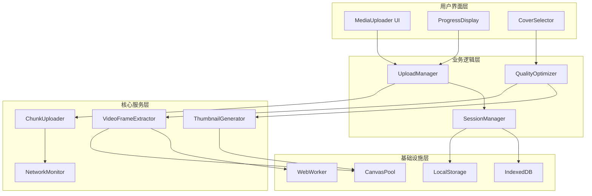
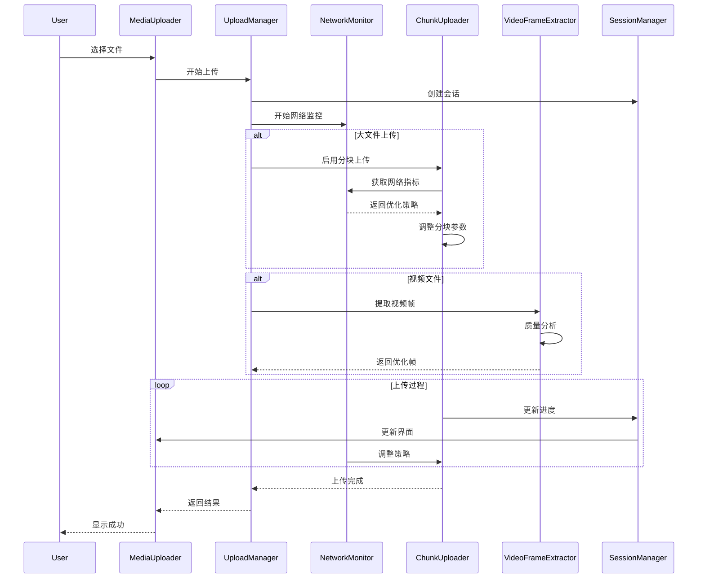

# 大文件上传优化与视频封面质量提升设计文档

## 概述

本设计文档详细描述了媒体上传系统的优化方案，重点解决500MB大视频文件上传性能问题和视频封面质量提升。设计采用模块化架构，通过智能分块、网络自适应、高质量帧提取和资源优化等技术手段，显著提升用户体验。

## 架构设计

### 整体架构



### 核心模块设计

#### 1. 智能分块上传器 (AdaptiveChunkUploader)

**职责**: 根据网络状况和文件大小动态调整分块策略

**核心算法**:
```typescript
interface ChunkStrategy {
  chunkSize: number;      // 分块大小 (1MB - 50MB)
  concurrency: number;    // 并发数 (1 - 8)
  retryPolicy: RetryPolicy;
  timeout: number;
}

class AdaptiveChunkUploader {
  calculateStrategy(fileSize: number, networkMetrics: NetworkMetrics): ChunkStrategy {
    // 基础策略
    let chunkSize = Math.min(fileSize / 100, 20 * MB);
    let concurrency = 3;
    
    // 网络速度调整
    if (networkMetrics.speed > 50 * MB) {
      chunkSize = Math.min(50 * MB, chunkSize * 2);
      concurrency = Math.min(8, concurrency + 2);
    } else if (networkMetrics.speed < 5 * MB) {
      chunkSize = Math.max(2 * MB, chunkSize / 2);
      concurrency = Math.max(1, concurrency - 1);
    }
    
    // 稳定性调整
    if (networkMetrics.stability === 'poor') {
      chunkSize = Math.max(1 * MB, chunkSize / 2);
      concurrency = 1;
    }
    
    return { chunkSize, concurrency, retryPolicy, timeout };
  }
}
```

#### 2. 网络状态监控器 (NetworkMonitor)

**职责**: 实时监测网络性能并提供自适应建议

**监控指标**:
- 上传速度 (bytes/s)
- 网络延迟 (ms)
- 连接稳定性
- 错误率统计

```typescript
interface NetworkMetrics {
  speed: number;           // 当前上传速度
  avgSpeed: number;        // 平均速度
  latency: number;         // 网络延迟
  stability: 'excellent' | 'good' | 'fair' | 'poor';
  errorRate: number;       // 错误率
  lastUpdated: number;
}

class NetworkMonitor {
  private metrics: NetworkMetrics;
  private speedSamples: number[] = [];
  private latencySamples: number[] = [];
  
  updateMetrics(uploadedBytes: number, timeElapsed: number): void {
    const currentSpeed = uploadedBytes / timeElapsed;
    this.speedSamples.push(currentSpeed);
    
    // 保持最近10个样本
    if (this.speedSamples.length > 10) {
      this.speedSamples.shift();
    }
    
    this.metrics.speed = currentSpeed;
    this.metrics.avgSpeed = this.calculateAverage(this.speedSamples);
    this.metrics.stability = this.calculateStability();
  }
  
  private calculateStability(): NetworkMetrics['stability'] {
    const variance = this.calculateVariance(this.speedSamples);
    const coefficient = variance / this.metrics.avgSpeed;
    
    if (coefficient < 0.1) return 'excellent';
    if (coefficient < 0.3) return 'good';
    if (coefficient < 0.6) return 'fair';
    return 'poor';
  }
}
```

#### 3. 高质量视频帧提取器 (EnhancedVideoFrameExtractor)

**职责**: 提取高质量视频帧并进行智能优化

**关键改进**:
- 支持4K分辨率提取
- 智能关键帧检测
- 多线程处理
- 内存优化

```typescript
interface FrameQualityMetrics {
  sharpness: number;      // 清晰度评分 (0-100)
  brightness: number;     // 亮度评分 (0-100)
  contrast: number;       // 对比度评分 (0-100)
  composition: number;    // 构图评分 (0-100)
  faceDetection: boolean; // 是否包含人脸
  overall: number;        // 综合评分
}

class EnhancedVideoFrameExtractor {
  async extractOptimalFrames(
    file: File, 
    options: ExtractOptions
  ): Promise<OptimizedFrame[]> {
    // 1. 使用WebWorker进行并行处理
    const worker = new Worker('/workers/frame-extractor.js');
    
    // 2. 智能采样策略
    const samplePoints = this.calculateOptimalSamplePoints(file);
    
    // 3. 并行提取候选帧
    const candidateFrames = await this.extractCandidateFrames(
      file, 
      samplePoints, 
      worker
    );
    
    // 4. 质量评估和排序
    const rankedFrames = await this.rankFramesByQuality(candidateFrames);
    
    // 5. 生成多尺寸缩略图
    const optimizedFrames = await this.generateMultiSizeThumbnails(
      rankedFrames.slice(0, 5)
    );
    
    worker.terminate();
    return optimizedFrames;
  }
  
  private async calculateSharpness(imageData: ImageData): Promise<number> {
    // 使用Sobel算子计算图像清晰度
    const { data, width, height } = imageData;
    let sharpness = 0;
    
    for (let y = 1; y < height - 1; y++) {
      for (let x = 1; x < width - 1; x++) {
        const idx = (y * width + x) * 4;
        
        // 计算梯度
        const gx = Math.abs(data[idx] - data[idx - 4]) + 
                   Math.abs(data[idx + 4] - data[idx]);
        const gy = Math.abs(data[idx] - data[idx - width * 4]) + 
                   Math.abs(data[idx + width * 4] - data[idx]);
        
        sharpness += Math.sqrt(gx * gx + gy * gy);
      }
    }
    
    return sharpness / (width * height);
  }
}
```

#### 4. 智能缩略图生成器 (IntelligentThumbnailGenerator)

**职责**: 生成多尺寸、高质量的视频缩略图

**特性**:
- 自适应尺寸调整
- 智能裁剪算法
- 格式优化
- 批量处理

```typescript
interface ThumbnailSpec {
  width: number;
  height: number;
  quality: number;
  format: 'jpeg' | 'webp' | 'avif';
  cropStrategy: 'center' | 'smart' | 'face-focus';
}

class IntelligentThumbnailGenerator {
  private canvasPool: CanvasPool;
  private workerPool: WorkerPool;
  
  async generateThumbnails(
    sourceFrame: VideoFrame,
    specs: ThumbnailSpec[]
  ): Promise<ThumbnailResult[]> {
    const results: ThumbnailResult[] = [];
    
    // 并行生成不同尺寸的缩略图
    const promises = specs.map(spec => 
      this.generateSingleThumbnail(sourceFrame, spec)
    );
    
    const thumbnails = await Promise.all(promises);
    
    return thumbnails.map((thumbnail, index) => ({
      ...thumbnail,
      spec: specs[index],
      size: thumbnail.blob.size,
      url: URL.createObjectURL(thumbnail.blob)
    }));
  }
  
  private async generateSingleThumbnail(
    sourceFrame: VideoFrame,
    spec: ThumbnailSpec
  ): Promise<{ blob: Blob; dataUrl: string }> {
    const canvas = this.canvasPool.acquire();
    const ctx = canvas.getContext('2d')!;
    
    try {
      // 计算最优裁剪区域
      const cropArea = await this.calculateOptimalCrop(
        sourceFrame, 
        spec.width, 
        spec.height, 
        spec.cropStrategy
      );
      
      // 设置canvas尺寸
      canvas.width = spec.width;
      canvas.height = spec.height;
      
      // 应用图像增强
      await this.applyImageEnhancement(ctx, sourceFrame, cropArea);
      
      // 生成输出
      const blob = await this.canvasToBlob(canvas, spec.format, spec.quality);
      const dataUrl = canvas.toDataURL(`image/${spec.format}`, spec.quality);
      
      return { blob, dataUrl };
    } finally {
      this.canvasPool.release(canvas);
    }
  }
  
  private async calculateOptimalCrop(
    frame: VideoFrame,
    targetWidth: number,
    targetHeight: number,
    strategy: ThumbnailSpec['cropStrategy']
  ): Promise<CropArea> {
    switch (strategy) {
      case 'center':
        return this.centerCrop(frame, targetWidth, targetHeight);
      case 'smart':
        return this.smartCrop(frame, targetWidth, targetHeight);
      case 'face-focus':
        return this.faceFocusCrop(frame, targetWidth, targetHeight);
    }
  }
}
```

#### 5. 上传会话管理器 (UploadSessionManager)

**职责**: 管理上传会话的持久化和恢复

```typescript
interface UploadSession {
  id: string;
  fileId: string;
  fileName: string;
  fileSize: number;
  fileHash: string;
  chunkSize: number;
  totalChunks: number;
  uploadedChunks: Set<number>;
  uploadedBytes: number;
  startTime: number;
  lastActivity: number;
  status: 'active' | 'paused' | 'completed' | 'failed';
  metadata: {
    category: string;
    fileType: string;
    originalName: string;
  };
}

class UploadSessionManager {
  private sessions = new Map<string, UploadSession>();
  private storage: SessionStorage;
  
  async createSession(file: File, options: UploadOptions): Promise<UploadSession> {
    const fileHash = await this.calculateFileHash(file);
    const sessionId = `upload_${Date.now()}_${Math.random().toString(36).slice(2)}`;
    
    const session: UploadSession = {
      id: sessionId,
      fileId: Math.random().toString(36).slice(2),
      fileName: file.name,
      fileSize: file.size,
      fileHash,
      chunkSize: options.chunkSize,
      totalChunks: Math.ceil(file.size / options.chunkSize),
      uploadedChunks: new Set(),
      uploadedBytes: 0,
      startTime: Date.now(),
      lastActivity: Date.now(),
      status: 'active',
      metadata: {
        category: options.category,
        fileType: file.type,
        originalName: file.name
      }
    };
    
    this.sessions.set(sessionId, session);
    await this.persistSession(session);
    
    return session;
  }
  
  async recoverSessions(): Promise<UploadSession[]> {
    const storedSessions = await this.storage.getAllSessions();
    const validSessions: UploadSession[] = [];
    
    for (const session of storedSessions) {
      // 检查会话是否仍然有效
      if (this.isSessionValid(session)) {
        this.sessions.set(session.id, session);
        validSessions.push(session);
      } else {
        await this.storage.removeSession(session.id);
      }
    }
    
    return validSessions;
  }
  
  private isSessionValid(session: UploadSession): boolean {
    const now = Date.now();
    const maxAge = 24 * 60 * 60 * 1000; // 24小时
    
    return (now - session.lastActivity) < maxAge && 
           session.status !== 'completed';
  }
}
```

## 组件和接口

### 主要接口定义

```typescript
// 上传配置接口
interface OptimizedUploadConfig extends MediaUploadConfig {
  // 性能优化配置
  adaptiveChunking: boolean;
  networkMonitoring: boolean;
  memoryOptimization: boolean;
  
  // 分块配置
  minChunkSize: number;
  maxChunkSize: number;
  maxConcurrency: number;
  
  // 视频处理配置
  videoProcessing: {
    extractFrames: boolean;
    frameCount: number;
    maxResolution: number;
    qualityAnalysis: boolean;
    smartCropping: boolean;
  };
  
  // 缓存配置
  enablePersistence: boolean;
  sessionTimeout: number;
  cacheSize: number;
}

// 网络指标接口
interface NetworkMetrics {
  speed: number;
  avgSpeed: number;
  latency: number;
  stability: 'excellent' | 'good' | 'fair' | 'poor';
  errorRate: number;
  recommendation: ChunkStrategy;
}

// 视频帧质量接口
interface FrameQualityAnalysis {
  sharpness: number;
  brightness: number;
  contrast: number;
  composition: number;
  faceDetection: boolean;
  overall: number;
  recommendation: 'excellent' | 'good' | 'fair' | 'poor';
}

// 优化后的上传结果
interface OptimizedUploadResult extends DirectUploadResult {
  performance: {
    uploadTime: number;
    avgSpeed: number;
    chunkStrategy: ChunkStrategy;
    retryCount: number;
  };
  thumbnails?: ThumbnailResult[];
  qualityAnalysis?: FrameQualityAnalysis;
}
```

### 组件交互流程



## 数据模型

### 上传会话数据模型

```typescript
// IndexedDB 存储结构
interface SessionStore {
  sessions: {
    id: string;
    data: UploadSession;
    created: number;
    updated: number;
  }[];
  
  chunks: {
    sessionId: string;
    chunkIndex: number;
    hash: string;
    uploaded: boolean;
    retryCount: number;
  }[];
  
  metrics: {
    sessionId: string;
    timestamp: number;
    networkMetrics: NetworkMetrics;
    performance: PerformanceMetrics;
  }[];
}

// 性能指标数据模型
interface PerformanceMetrics {
  uploadSpeed: number;
  memoryUsage: number;
  cpuUsage: number;
  errorCount: number;
  retryCount: number;
  chunkStrategy: ChunkStrategy;
}
```

### 视频处理数据模型

```typescript
// 视频分析结果
interface VideoAnalysisResult {
  metadata: {
    duration: number;
    width: number;
    height: number;
    fps: number;
    bitrate: number;
  };
  
  frames: {
    timestamp: number;
    quality: FrameQualityAnalysis;
    thumbnail: ThumbnailResult;
    keyframe: boolean;
  }[];
  
  recommendations: {
    bestFrame: number;
    alternativeFrames: number[];
    qualityScore: number;
  };
}
```

## 错误处理

### 错误分类和处理策略

```typescript
enum UploadErrorType {
  NETWORK_ERROR = 'network_error',
  SERVER_ERROR = 'server_error',
  FILE_ERROR = 'file_error',
  QUOTA_ERROR = 'quota_error',
  TIMEOUT_ERROR = 'timeout_error',
  VALIDATION_ERROR = 'validation_error'
}

interface ErrorHandlingStrategy {
  type: UploadErrorType;
  retryable: boolean;
  maxRetries: number;
  backoffStrategy: 'linear' | 'exponential' | 'fixed';
  userMessage: string;
  recoveryAction?: () => Promise<void>;
}

class ErrorHandler {
  private strategies = new Map<UploadErrorType, ErrorHandlingStrategy>();
  
  constructor() {
    this.initializeStrategies();
  }
  
  async handleError(error: UploadError): Promise<ErrorHandlingResult> {
    const strategy = this.strategies.get(error.type);
    
    if (!strategy) {
      return { shouldRetry: false, userMessage: '未知错误' };
    }
    
    if (strategy.retryable && error.retryCount < strategy.maxRetries) {
      const delay = this.calculateBackoffDelay(
        error.retryCount, 
        strategy.backoffStrategy
      );
      
      return {
        shouldRetry: true,
        delay,
        userMessage: `${strategy.userMessage}，${delay/1000}秒后重试...`
      };
    }
    
    return {
      shouldRetry: false,
      userMessage: strategy.userMessage,
      recoveryAction: strategy.recoveryAction
    };
  }
}
```

## 测试策略

### 性能测试

1. **大文件上传测试**
   - 测试500MB文件上传性能
   - 不同网络条件下的适应性测试
   - 并发上传压力测试

2. **网络适应性测试**
   - 模拟不同网络速度和稳定性
   - 网络中断和恢复测试
   - 移动网络环境测试

3. **视频处理测试**
   - 不同分辨率视频的帧提取测试
   - 质量分析算法准确性测试
   - 内存使用和性能测试

### 功能测试

1. **断点续传测试**
   - 上传中断后的恢复测试
   - 会话持久化测试
   - 数据完整性验证

2. **用户界面测试**
   - 进度显示准确性测试
   - 错误信息展示测试
   - 响应式设计测试

### 兼容性测试

1. **浏览器兼容性**
   - Chrome, Firefox, Safari, Edge
   - 移动端浏览器测试

2. **设备兼容性**
   - 不同性能设备测试
   - 内存限制设备测试

## 部署和监控

### 部署策略

1. **渐进式部署**
   - 功能开关控制新特性
   - A/B测试验证性能提升
   - 灰度发布降低风险

2. **性能监控**
   - 上传成功率监控
   - 平均上传速度监控
   - 错误率和类型统计

3. **用户体验监控**
   - 用户操作流程分析
   - 界面响应时间监控
   - 用户满意度调研

### 运维指标

```typescript
interface MonitoringMetrics {
  // 性能指标
  performance: {
    avgUploadSpeed: number;
    successRate: number;
    errorRate: number;
    avgFileSize: number;
  };
  
  // 用户体验指标
  userExperience: {
    avgUploadTime: number;
    retryRate: number;
    abandonmentRate: number;
    satisfactionScore: number;
  };
  
  // 系统资源指标
  resources: {
    memoryUsage: number;
    cpuUsage: number;
    storageUsage: number;
    networkBandwidth: number;
  };
}
```

这个设计文档提供了完整的技术方案，涵盖了架构设计、核心算法、接口定义、数据模型、错误处理、测试策略和部署监控等各个方面，为后续的开发实施提供了详细的指导。