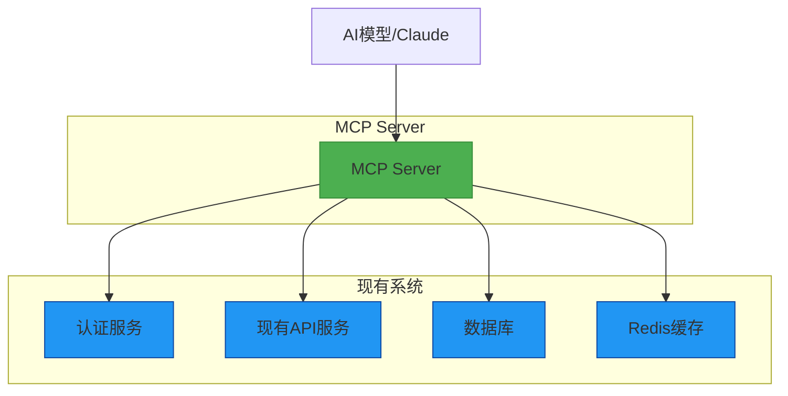
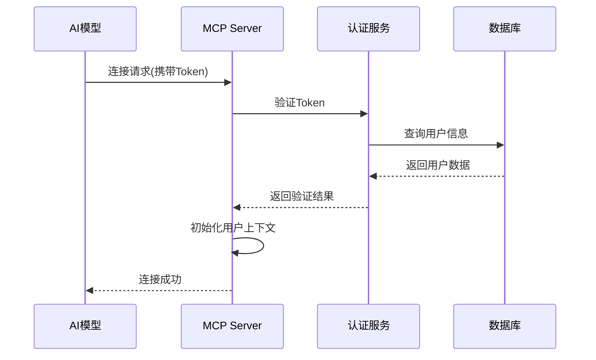
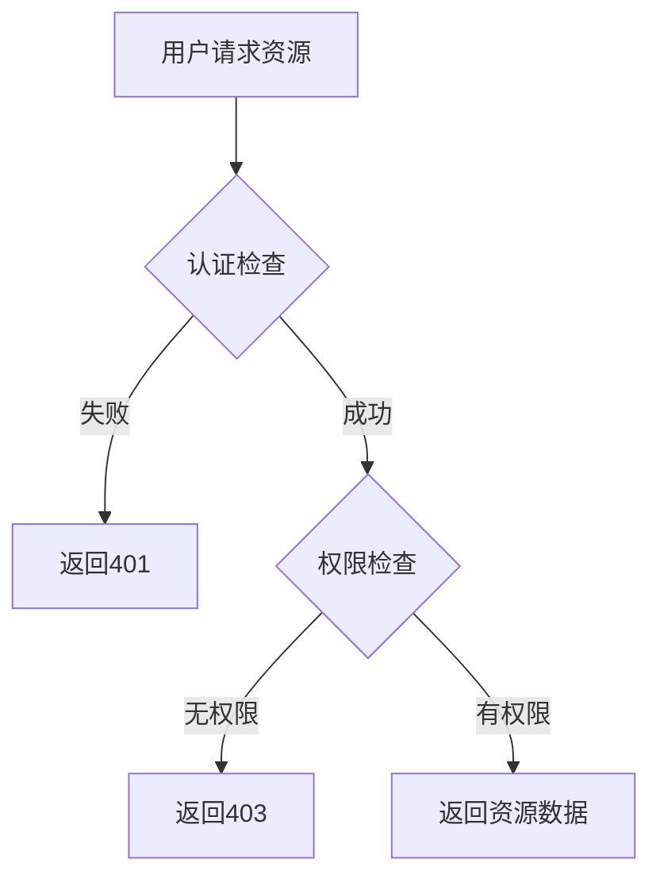
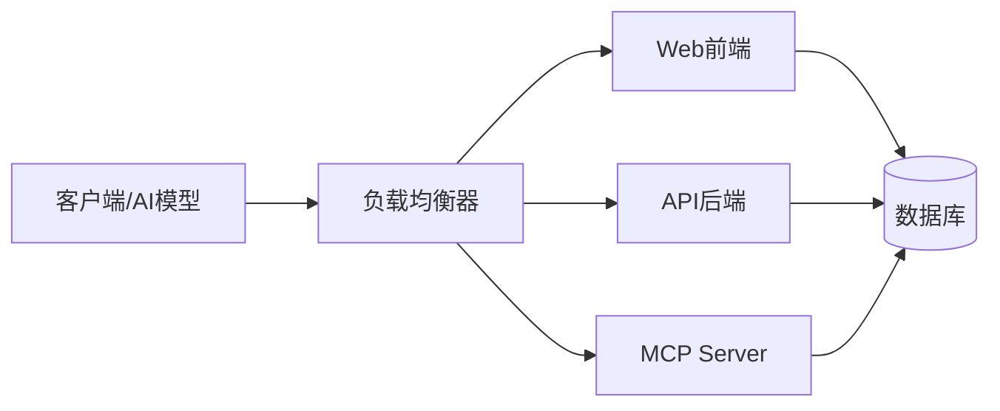

# MCP Server 开发设计文档

## 1. 概述

### 1.1 项目背景
本项目旨在为现有的婚礼俱乐部管理系统开发一个MCP (Model Context Protocol) Server，以允许AI模型（如Claude）连接到系统并访问数据和服务。MCP Server将作为AI代理与现有后端系统之间的桥梁，提供标准化的接口供AI模型查询和操作数据。

### 1.2 核心价值
- 为AI模型提供访问婚礼俱乐部管理系统数据的标准化接口
- 支持AI代理执行查询、创建、更新和删除操作
- 保持现有系统的安全性和权限控制
- 实现与现有认证和授权机制的集成

## 2. 架构设计

### 2.1 系统架构图


### 2.2 技术栈
- **语言**: TypeScript (与现有后端保持一致)
- **框架**: Express.js (与现有后端保持一致)
- **协议**: Model Context Protocol (MCP)
- **认证**: JWT (与现有系统集成)
- **依赖管理**: npm/yarn
- **MCP库**: @modelcontextprotocol/server (官方SDK)

### 2.3 核心组件
1. **MCP Server核心**: 实现MCP协议的Express服务器
2. **认证模块**: 与现有JWT认证系统集成
3. **资源提供器**: 提供对系统数据的访问接口
4. **工具模块**: 提供可执行的操作（如创建、更新数据）
5. **权限控制**: 与现有RBAC系统集成

## 3. 功能模块设计

### 3.1 认证与授权
MCP Server需要与现有系统的认证机制集成，确保AI代理只能访问授权的数据和功能。

#### 认证流程


### 3.2 资源提供器
资源提供器允许AI模型读取系统中的数据，如用户、作品、档期等。

#### 支持的资源类型
| 资源类型 | 描述 | 访问权限 |
|---------|------|---------|
| users | 用户信息 | 管理员可访问全部，普通用户仅可访问自己的信息 |
| works | 作品信息 | 公开作品可访问，私人作品需权限 |
| schedules | 档期信息 | 管理员可访问全部，普通用户仅可访问自己的档期 |
| teams | 团队信息 | 团队成员可访问 |
| files | 文件信息 | 文件所有者可访问 |

### 3.3 工具模块
工具模块提供可执行的操作，允许AI模型修改系统状态。

#### 支持的工具
| 工具名称 | 功能描述 | 权限要求 |
|---------|---------|---------|
| createIssue | 创建问题报告 | 所有用户 |
| updateSchedule | 更新档期状态 | 档期所有者或管理员 |
| createUser | 创建新用户 | 管理员 |
| assignTeamMember | 分配团队成员 | 团队所有者或管理员 |
| updateWorkStatus | 更新作品状态 | 作品所有者或管理员 |

## 4. API接口设计

### 4.1 MCP标准接口
MCP Server将实现以下标准MCP接口：

#### 初始化接口
- **initialize**: 初始化MCP会话，设置上下文
- **ping**: 健康检查接口

#### 资源接口
- **listRoots**: 列出根资源
- **readResource**: 读取指定资源
- **getResources**: 批量获取资源
- **subscribe**: 订阅资源变更（可选）

#### 工具接口
- **listTools**: 列出可用工具
- **callTool**: 调用指定工具

#### 提示接口
- **listPrompts**: 列出可用提示模板
- **getPrompt**: 获取提示模板内容
- **runPrompt**: 运行提示模板

#### 其他接口
- **listResourceTemplates**: 列出资源模板
- **renderResourceTemplate**: 渲染资源模板
- **listPrompts**: 列出系统提示
- **showPrompt**: 显示提示详情

### 4.2 接口安全设计
所有接口都将通过JWT Token进行身份验证，并实施以下安全措施：
1. 基于角色的访问控制(RBAC)
2. 请求频率限制
3. 输入验证和清理
4. 安全头设置

## 5. 数据模型映射

### 5.1 现有数据模型
MCP Server将直接使用现有的数据模型，无需创建新的数据结构：

| MCP资源 | 对应现有模型 | 数据源 |
|--------|------------|-------|
| UserResource | User模型 | users表 |
| WorkResource | Work模型 | works表 |
| ScheduleResource | Schedule模型 | schedules表 |
| TeamResource | Team模型 | teams表 |
| FileResource | File模型 | files表 |

### 5.2 资源访问控制
资源访问将基于现有的权限系统实现：



## 6. 部署架构

### 6.1 部署方式
MCP Server将作为独立服务部署，与现有后端服务并行运行：



### 6.2 环境配置
MCP Server将复用现有系统的环境配置，包括：
- 数据库连接配置
- Redis配置
- JWT密钥
- OSS存储配置

新增环境变量：
- `MCP_PORT`: MCP Server监听端口 (默认: 3002)
- `MCP_HOST`: MCP Server绑定地址 (默认: localhost)
- `MCP_JWT_SECRET`: MCP专用JWT密钥 (可选，用于AI代理认证)
- `MCP_RATE_LIMIT_WINDOW`: 请求频率限制窗口 (默认: 15分钟)
- `MCP_RATE_LIMIT_MAX`: 窗口期内最大请求数 (默认: 100)

### 6.3 容器化部署
MCP Server将提供Dockerfile支持容器化部署，与现有服务保持一致。

#### Docker配置
- 基于现有Dockerfile构建，复用优化的多阶段构建策略
- 暴露MCP服务端口 (默认: 3002)
- 集成健康检查端点 `/mcp/health`
- 支持多阶段构建，优化镜像大小
- 复用现有的npm镜像源配置和依赖优化策略

#### Docker Compose集成
- 添加mcp-server服务定义
- 配置与现有服务的网络连接
- 设置环境变量
- 配置数据卷挂载
- 复用现有的构建和部署策略

## 7. 安全机制

### 7.1 认证安全
- 集成现有JWT认证机制
- Token过期时间控制
- 刷新Token机制

### 7.2 授权安全
- 基于角色的访问控制(RBAC)
- 资源级权限检查
- 操作级权限验证

### 7.3 通信安全
- HTTPS加密传输
- CORS策略配置
- 请求频率限制

### 7.4 数据安全
- 敏感信息过滤
- 输入验证和清理
- SQL注入防护

## 8. 性能优化

### 8.1 缓存策略
- Redis缓存常用资源数据
- 缓存用户权限信息
- 缓存系统配置

### 8.2 数据库优化
- 复用现有数据库连接池
- 查询结果分页
- 索引优化

### 8.3 响应优化
- 压缩响应数据
- 异步处理耗时操作
- 连接复用

## 9. 监控与日志

### 9.1 日志记录
- 请求日志记录 (包含AI模型请求详情)
- 错误日志记录 (包含详细的错误堆栈信息)
- 性能日志记录 (记录请求处理时间)
- 集成现有Winston日志系统
- 支持不同日志级别配置 (debug, info, warn, error)
- 结构化日志输出，便于分析和监控

### 9.2 监控指标
- 请求响应时间
- 错误率统计
- 资源访问统计
- 复用现有Prometheus监控配置

### 9.3 告警机制
- 异常请求告警
- 性能下降告警
- 系统错误告警
- 集成现有告警系统

## 10. 测试策略

### 10.1 单元测试
- 使用Jest进行单元测试
- 覆盖核心功能模块
- 模拟数据库和外部服务

### 10.2 集成测试
- 测试与现有认证系统的集成
- 测试资源访问权限控制
- 测试工具调用功能

### 10.3 端到端测试
- 模拟AI模型与MCP Server的交互
- 验证完整的请求处理流程
- 测试异常处理机制

## 11. 项目结构

### 11.1 目录结构
```
server/src/mcp/
├── config/              # MCP配置
├── controllers/         # MCP控制器
├── middlewares/         # MCP中间件
├── models/              # MCP数据模型映射
├── routes/              # MCP路由
├── services/            # MCP服务层
├── utils/               # MCP工具函数
├── validators/          # MCP验证器
├── app.ts              # MCP应用实例
└── server.ts           # MCP服务入口
```

### 11.2 与现有系统的集成点
- 复用现有配置管理 (`config/`)
- 集成现有认证服务 (`services/auth.service.ts`)
- 使用现有数据模型 (`models/`)
- 复用现有工具函数 (`utils/`)
- 集成现有日志系统 (`utils/logger.ts`)

## 12. 开发计划

### 12.1 第一阶段：核心框架搭建
- 实现MCP Server基础架构
- 集成现有认证系统
- 实现基础资源访问功能

### 12.2 第二阶段：功能完善
- 实现完整的资源提供器
- 开发工具模块
- 完善权限控制机制

### 12.3 第三阶段：测试与优化
- 编写测试用例
- 性能优化
- 安全加固

### 12.4 第四阶段：部署与监控
- 完善部署配置
- 集成监控系统
- 文档完善

## 13. 风险评估与应对

### 13.1 技术风险
- MCP协议实现复杂性：采用官方SDK降低实现难度
- 与现有系统集成问题：复用现有组件和配置减少集成风险
- 性能瓶颈：通过缓存和异步处理优化性能

### 13.2 安全风险
- 权限控制不当：严格实现RBAC权限控制
- 数据泄露：敏感信息过滤和传输加密
- 滥用风险：实现请求频率限制和监控告警