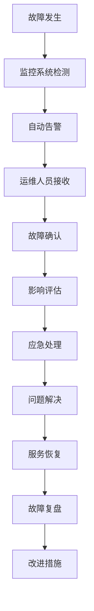

# 婚礼主持俱乐部官方网站 - 运维手册

## 🛠️ 运维概述

### 运维目标
- **高可用性**：确保系统7×24小时稳定运行
- **性能优化**：持续监控和优化系统性能
- **安全保障**：维护系统安全，防范各类威胁
- **快速响应**：及时处理故障和异常情况
- **数据安全**：保障数据完整性和可恢复性

### 运维职责
- **系统监控**：实时监控系统运行状态
- **故障处理**：快速定位和解决系统故障
- **性能调优**：优化系统性能和资源利用率
- **安全维护**：更新安全补丁，维护安全策略
- **备份管理**：定期备份数据，验证备份有效性
- **容量规划**：预测和规划系统容量需求

## 📊 系统监控

### 监控架构
```
┌─────────────────────────────────────────────────────────────────┐
│                        监控体系架构                              │
├─────────────────────────────────────────────────────────────────┤
│                                                                 │
│  ┌─────────────────────────────────────────────────────────┐   │
│  │                   数据采集层                            │   │
│  │  • 系统指标采集    • 应用指标采集    • 日志采集          │   │
│  │  • 网络监控        • 数据库监控      • 容器监控          │   │
│  └─────────────────────────────────────────────────────────┘   │
│                                │                               │
│                                ▼                               │
│  ┌─────────────────────────────────────────────────────────┐   │
│  │                   数据存储层                            │   │
│  │  • 时序数据库      • 日志存储        • 配置存储          │   │
│  │  • 元数据存储      • 告警规则存储    • 历史数据归档      │   │
│  └─────────────────────────────────────────────────────────┘   │
│                                │                               │
│                                ▼                               │
│  ┌─────────────────────────────────────────────────────────┐   │
│  │                   数据处理层                            │   │
│  │  • 数据聚合        • 异常检测        • 趋势分析          │   │
│  │  • 告警计算        • 报表生成        • 数据清洗          │   │
│  └─────────────────────────────────────────────────────────┘   │
│                                │                               │
│                                ▼                               │
│  ┌─────────────────────────────────────────────────────────┐   │
│  │                   展示告警层                            │   │
│  │  • 监控大屏        • 告警通知        • 报表展示          │   │
│  │  • 移动端监控      • API接口         • 自定义仪表板      │   │
│  └─────────────────────────────────────────────────────────┘   │
│                                                                 │
└─────────────────────────────────────────────────────────────────┘
```

### 核心监控指标

#### 系统指标
```bash
# CPU使用率
cpu_usage_percent{instance="server1"} 75.2

# 内存使用率
memory_usage_percent{instance="server1"} 68.5

# 磁盘使用率
disk_usage_percent{instance="server1",device="/dev/sda1"} 45.3

# 网络流量
network_bytes_sent{instance="server1",interface="eth0"} 1024000
network_bytes_received{instance="server1",interface="eth0"} 2048000

# 系统负载
system_load_1m{instance="server1"} 2.15
system_load_5m{instance="server1"} 1.98
system_load_15m{instance="server1"} 1.85
```

#### 应用指标
```bash
# HTTP请求指标
http_requests_total{method="GET",status="200"} 15420
http_requests_total{method="POST",status="201"} 3250
http_request_duration_seconds{quantile="0.95"} 0.245

# 数据库连接
db_connections_active{database="wedding_prod"} 25
db_connections_idle{database="wedding_prod"} 15
db_query_duration_seconds{quantile="0.95"} 0.125

# 缓存指标
redis_connected_clients 45
redis_memory_usage_bytes 134217728
redis_keyspace_hits_total 98765
redis_keyspace_misses_total 1234

# 应用错误率
error_rate_percent{service="wedding-api"} 0.05
error_rate_percent{service="wedding-web"} 0.02
```

### 监控配置

#### Prometheus配置
```yaml
# prometheus.yml
global:
  scrape_interval: 15s
  evaluation_interval: 15s

rule_files:
  - "alert_rules.yml"

alerting:
  alertmanagers:
    - static_configs:
        - targets:
          - alertmanager:9093

scrape_configs:
  # 系统监控
  - job_name: 'node-exporter'
    static_configs:
      - targets: ['node-exporter:9100']
    scrape_interval: 15s
    metrics_path: /metrics

  # 应用监控
  - job_name: 'wedding-api'
    static_configs:
      - targets: ['wedding-api:3000']
    scrape_interval: 30s
    metrics_path: /metrics

  # 数据库监控
  - job_name: 'mysql-exporter'
    static_configs:
      - targets: ['mysql-exporter:9104']
    scrape_interval: 30s

  # Redis监控
  - job_name: 'redis-exporter'
    static_configs:
      - targets: ['redis-exporter:9121']
    scrape_interval: 30s

  # Nginx监控
  - job_name: 'nginx-exporter'
    static_configs:
      - targets: ['nginx-exporter:9113']
    scrape_interval: 30s
```

#### 告警规则
```yaml
# alert_rules.yml
groups:
  - name: system_alerts
    rules:
      # CPU使用率告警
      - alert: HighCPUUsage
        expr: cpu_usage_percent > 80
        for: 5m
        labels:
          severity: warning
        annotations:
          summary: "CPU使用率过高"
          description: "{{ $labels.instance }} CPU使用率 {{ $value }}% 超过80%"

      # 内存使用率告警
      - alert: HighMemoryUsage
        expr: memory_usage_percent > 85
        for: 5m
        labels:
          severity: warning
        annotations:
          summary: "内存使用率过高"
          description: "{{ $labels.instance }} 内存使用率 {{ $value }}% 超过85%"

      # 磁盘空间告警
      - alert: HighDiskUsage
        expr: disk_usage_percent > 90
        for: 2m
        labels:
          severity: critical
        annotations:
          summary: "磁盘空间不足"
          description: "{{ $labels.instance }} 磁盘 {{ $labels.device }} 使用率 {{ $value }}% 超过90%"

  - name: application_alerts
    rules:
      # 应用响应时间告警
      - alert: HighResponseTime
        expr: http_request_duration_seconds{quantile="0.95"} > 1
        for: 3m
        labels:
          severity: warning
        annotations:
          summary: "应用响应时间过长"
          description: "95%请求响应时间 {{ $value }}s 超过1秒"

      # 错误率告警
      - alert: HighErrorRate
        expr: error_rate_percent > 1
        for: 2m
        labels:
          severity: critical
        annotations:
          summary: "应用错误率过高"
          description: "{{ $labels.service }} 错误率 {{ $value }}% 超过1%"

      # 数据库连接告警
      - alert: DatabaseConnectionHigh
        expr: db_connections_active > 80
        for: 5m
        labels:
          severity: warning
        annotations:
          summary: "数据库连接数过高"
          description: "数据库活跃连接数 {{ $value }} 超过80"

  - name: service_alerts
    rules:
      # 服务不可用告警
      - alert: ServiceDown
        expr: up == 0
        for: 1m
        labels:
          severity: critical
        annotations:
          summary: "服务不可用"
          description: "{{ $labels.job }} 服务已停止响应"
```

### 日志管理

#### 日志收集配置
```yaml
# filebeat.yml
filebeat.inputs:
  # 应用日志
  - type: log
    enabled: true
    paths:
      - /var/log/wedding-api/*.log
    fields:
      service: wedding-api
      environment: production
    multiline.pattern: '^\d{4}-\d{2}-\d{2}'
    multiline.negate: true
    multiline.match: after

  # Nginx访问日志
  - type: log
    enabled: true
    paths:
      - /var/log/nginx/access.log
    fields:
      service: nginx
      log_type: access

  # Nginx错误日志
  - type: log
    enabled: true
    paths:
      - /var/log/nginx/error.log
    fields:
      service: nginx
      log_type: error

output.elasticsearch:
  hosts: ["elasticsearch:9200"]
  index: "wedding-logs-%{+yyyy.MM.dd}"

processors:
  - add_host_metadata:
      when.not.contains.tags: forwarded
```

#### 日志分析查询
```json
// Elasticsearch查询示例

// 查询错误日志
{
  "query": {
    "bool": {
      "must": [
        {"match": {"fields.service": "wedding-api"}},
        {"match": {"level": "error"}},
        {"range": {"@timestamp": {"gte": "now-1h"}}}
      ]
    }
  },
  "sort": [{"@timestamp": {"order": "desc"}}]
}

// 查询慢请求
{
  "query": {
    "bool": {
      "must": [
        {"match": {"fields.service": "nginx"}},
        {"range": {"response_time": {"gte": 1000}}}
      ]
    }
  },
  "aggs": {
    "avg_response_time": {
      "avg": {"field": "response_time"}
    }
  }
}
```

## 🚨 故障处理

### 故障分类

#### 系统故障
- **硬件故障**：服务器、网络设备故障
- **操作系统故障**：系统崩溃、内核错误
- **网络故障**：网络中断、延迟过高
- **存储故障**：磁盘故障、文件系统错误

#### 应用故障
- **服务不可用**：应用进程崩溃、端口不响应
- **性能问题**：响应时间过长、吞吐量下降
- **功能异常**：业务逻辑错误、数据不一致
- **资源耗尽**：内存泄漏、连接池耗尽

### 故障处理流程

#### 故障响应流程


#### 故障等级定义
```
P0 - 紧急故障
• 核心服务完全不可用
• 影响所有用户
• 数据丢失风险
• 响应时间：5分钟内
• 解决时间：1小时内

P1 - 高优先级故障
• 核心功能部分不可用
• 影响大部分用户
• 性能严重下降
• 响应时间：15分钟内
• 解决时间：4小时内

P2 - 中优先级故障
• 非核心功能异常
• 影响部分用户
• 性能轻微下降
• 响应时间：1小时内
• 解决时间：24小时内

P3 - 低优先级故障
• 功能缺陷
• 影响少数用户
• 不影响核心业务
• 响应时间：4小时内
• 解决时间：72小时内
```

### 常见故障处理

#### 服务不可用
```bash
# 1. 检查服务状态
docker ps | grep wedding
systemctl status docker

# 2. 查看服务日志
docker logs wedding-api-prod --tail 100
docker logs wedding-web-prod --tail 100

# 3. 检查资源使用
docker stats
df -h
free -h

# 4. 重启服务
./deploy.sh prod restart api
./deploy.sh prod restart web

# 5. 验证服务恢复
curl -I http://localhost/api/health
curl -I http://localhost/
```

#### 数据库连接问题
```bash
# 1. 检查数据库服务
docker logs wedding-mysql-prod --tail 50
docker exec wedding-mysql-prod mysqladmin ping

# 2. 检查连接数
docker exec wedding-mysql-prod mysql -e "SHOW PROCESSLIST;"
docker exec wedding-mysql-prod mysql -e "SHOW STATUS LIKE 'Threads_connected';"

# 3. 检查数据库配置
docker exec wedding-mysql-prod mysql -e "SHOW VARIABLES LIKE 'max_connections';"

# 4. 重启数据库（谨慎操作）
docker restart wedding-mysql-prod

# 5. 验证连接恢复
docker exec wedding-api-prod npm run db:test
```

#### 内存不足
```bash
# 1. 检查内存使用
free -h
docker stats --no-stream

# 2. 查找内存占用高的进程
ps aux --sort=-%mem | head -10

# 3. 清理系统缓存
sync && echo 3 > /proc/sys/vm/drop_caches

# 4. 重启占用内存高的服务
docker restart wedding-api-prod

# 5. 调整服务配置
# 编辑 docker-compose.yml 增加内存限制
```

#### 磁盘空间不足
```bash
# 1. 检查磁盘使用
df -h
du -sh /var/lib/docker/*

# 2. 清理Docker资源
docker system prune -a
docker volume prune

# 3. 清理日志文件
find /var/log -name "*.log" -mtime +7 -delete
journalctl --vacuum-time=7d

# 4. 清理临时文件
rm -rf /tmp/*
rm -rf /var/tmp/*

# 5. 归档旧数据
./deploy.sh prod backup db
./deploy.sh prod cleanup-old-data
```

## 🔧 性能优化

### 性能监控指标

#### 应用性能指标
```javascript
// 关键性能指标 (KPI)
const performanceMetrics = {
  // 响应时间
  responseTime: {
    p50: 200,    // 50%请求 < 200ms
    p95: 500,    // 95%请求 < 500ms
    p99: 1000    // 99%请求 < 1000ms
  },
  
  // 吞吐量
  throughput: {
    rps: 1000,   // 每秒请求数
    tps: 500     // 每秒事务数
  },
  
  // 错误率
  errorRate: {
    target: 0.1, // 目标错误率 < 0.1%
    warning: 0.5, // 告警阈值 0.5%
    critical: 1.0 // 严重阈值 1.0%
  },
  
  // 可用性
  availability: {
    target: 99.9, // 目标可用性 99.9%
    sla: 99.5     // SLA承诺 99.5%
  }
};
```

### 性能优化策略

#### 数据库优化
```sql
-- 1. 索引优化
-- 查看慢查询
SELECT * FROM mysql.slow_log WHERE start_time > DATE_SUB(NOW(), INTERVAL 1 HOUR);

-- 分析查询执行计划
EXPLAIN SELECT * FROM users WHERE email = 'user@example.com';

-- 创建复合索引
CREATE INDEX idx_user_email_status ON users(email, status);

-- 2. 查询优化
-- 避免SELECT *
SELECT id, username, email FROM users WHERE status = 'active';

-- 使用LIMIT限制结果集
SELECT * FROM schedules WHERE date >= '2025-09-01' LIMIT 100;

-- 3. 配置优化
-- 调整缓冲池大小
SET GLOBAL innodb_buffer_pool_size = 2147483648; -- 2GB

-- 调整连接数
SET GLOBAL max_connections = 200;

-- 启用查询缓存
SET GLOBAL query_cache_type = ON;
SET GLOBAL query_cache_size = 268435456; -- 256MB
```

#### 缓存优化
```javascript
// Redis缓存策略
const cacheStrategies = {
  // 1. 页面缓存
  pageCache: {
    key: 'page:home',
    ttl: 300, // 5分钟
    strategy: 'cache-aside'
  },
  
  // 2. 数据缓存
  dataCache: {
    key: 'user:profile:123',
    ttl: 3600, // 1小时
    strategy: 'write-through'
  },
  
  // 3. 会话缓存
  sessionCache: {
    key: 'session:token_abc',
    ttl: 86400, // 24小时
    strategy: 'write-behind'
  }
};

// 缓存实现示例
class CacheManager {
  constructor(redisClient) {
    this.redis = redisClient;
  }
  
  async get(key) {
    try {
      const value = await this.redis.get(key);
      return value ? JSON.parse(value) : null;
    } catch (error) {
      console.error('Cache get error:', error);
      return null;
    }
  }
  
  async set(key, value, ttl = 3600) {
    try {
      await this.redis.setex(key, ttl, JSON.stringify(value));
    } catch (error) {
      console.error('Cache set error:', error);
    }
  }
  
  async del(key) {
    try {
      await this.redis.del(key);
    } catch (error) {
      console.error('Cache delete error:', error);
    }
  }
}
```

#### 前端优化
```javascript
// 1. 代码分割
import { lazy, Suspense } from 'react';

const LazyComponent = lazy(() => import('./LazyComponent'));

function App() {
  return (
    <Suspense fallback={<div>Loading...</div>}>
      <LazyComponent />
    </Suspense>
  );
}

// 2. 图片优化
const ImageOptimizer = ({ src, alt, width, height }) => {
  const optimizedSrc = `${src}?w=${width}&h=${height}&q=80&f=webp`;
  
  return (
    
  );
};

// 3. 虚拟滚动
import { FixedSizeList as List } from 'react-window';

const VirtualList = ({ items }) => (
  <List
    height={600}
    itemCount={items.length}
    itemSize={50}
    itemData={items}
  >
    {({ index, style, data }) => (
      <div style={style}>
        {data[index].name}
      </div>
    )}
  </List>
);
```

## 💾 备份与恢复

### 备份策略

#### 备份类型
```
全量备份 (Full Backup)
• 频率：每周一次
• 时间：周日凌晨2:00
• 保留：4周
• 内容：完整数据库和文件

增量备份 (Incremental Backup)
• 频率：每日一次
• 时间：每日凌晨3:00
• 保留：7天
• 内容：自上次备份后的变更

差异备份 (Differential Backup)
• 频率：每12小时一次
• 时间：每日9:00和21:00
• 保留：3天
• 内容：自上次全量备份后的变更

实时备份 (Real-time Backup)
• 频率：实时同步
• 方式：主从复制
• 延迟：< 1秒
• 内容：关键业务数据
```

#### 备份脚本
```bash
#!/bin/bash
# backup.sh - 数据备份脚本

set -e

# 配置变量
BACKUP_DIR="/backup"
DATE=$(date +%Y%m%d_%H%M%S)
RETENTION_DAYS=30

# 创建备份目录
mkdir -p $BACKUP_DIR/{database,files,logs}

# 数据库备份
echo "开始数据库备份..."
docker exec wedding-mysql-prod mysqldump \
  --single-transaction \
  --routines \
  --triggers \
  --all-databases \
  -u root -p$DB_PASSWORD > $BACKUP_DIR/database/full_backup_$DATE.sql

# 压缩数据库备份
gzip $BACKUP_DIR/database/full_backup_$DATE.sql

# 文件备份
echo "开始文件备份..."
tar -czf $BACKUP_DIR/files/files_backup_$DATE.tar.gz \
  /var/lib/docker/volumes/wedding_uploads/_data

# 配置备份
echo "开始配置备份..."
tar -czf $BACKUP_DIR/files/config_backup_$DATE.tar.gz \
  deployment/environments \
  deployment/docker \
  docker-compose.yml

# 日志备份
echo "开始日志备份..."
tar -czf $BACKUP_DIR/logs/logs_backup_$DATE.tar.gz \
  /var/log/wedding-*

# 清理过期备份
echo "清理过期备份..."
find $BACKUP_DIR -name "*.gz" -mtime +$RETENTION_DAYS -delete
find $BACKUP_DIR -name "*.sql.gz" -mtime +$RETENTION_DAYS -delete

# 验证备份
echo "验证备份完整性..."
for file in $BACKUP_DIR/*/*.gz; do
  if ! gzip -t "$file"; then
    echo "备份文件损坏: $file"
    exit 1
  fi
done

# 上传到云存储（可选）
if [ "$CLOUD_BACKUP" = "true" ]; then
  echo "上传备份到云存储..."
  aws s3 sync $BACKUP_DIR s3://wedding-backup/$(date +%Y/%m/%d)/
fi

echo "备份完成: $DATE"
```

### 恢复流程

#### 数据库恢复
```bash
#!/bin/bash
# restore_database.sh - 数据库恢复脚本

BACKUP_FILE=$1
if [ -z "$BACKUP_FILE" ]; then
  echo "用法: $0 <backup_file>"
  exit 1
fi

echo "开始数据库恢复..."

# 停止应用服务
./deploy.sh prod stop api web

# 备份当前数据库
echo "备份当前数据库..."
docker exec wedding-mysql-prod mysqldump \
  --all-databases \
  -u root -p$DB_PASSWORD > /tmp/current_backup_$(date +%Y%m%d_%H%M%S).sql

# 恢复数据库
echo "恢复数据库..."
if [[ $BACKUP_FILE == *.gz ]]; then
  zcat $BACKUP_FILE | docker exec -i wedding-mysql-prod mysql -u root -p$DB_PASSWORD
else
  cat $BACKUP_FILE | docker exec -i wedding-mysql-prod mysql -u root -p$DB_PASSWORD
fi

# 验证数据库
echo "验证数据库..."
docker exec wedding-mysql-prod mysql -u root -p$DB_PASSWORD -e "SHOW DATABASES;"

# 重启应用服务
./deploy.sh prod start api web

echo "数据库恢复完成"
```

#### 文件恢复
```bash
#!/bin/bash
# restore_files.sh - 文件恢复脚本

BACKUP_FILE=$1
RESTORE_PATH=${2:-"/var/lib/docker/volumes/wedding_uploads/_data"}

if [ -z "$BACKUP_FILE" ]; then
  echo "用法: $0 <backup_file> [restore_path]"
  exit 1
fi

echo "开始文件恢复..."

# 备份当前文件
echo "备份当前文件..."
tar -czf /tmp/current_files_$(date +%Y%m%d_%H%M%S).tar.gz $RESTORE_PATH

# 恢复文件
echo "恢复文件..."
tar -xzf $BACKUP_FILE -C /

# 设置权限
chown -R 1000:1000 $RESTORE_PATH
chmod -R 755 $RESTORE_PATH

echo "文件恢复完成"
```

## 🔒 安全维护

### 安全检查清单

#### 定期安全检查
```bash
#!/bin/bash
# security_check.sh - 安全检查脚本

echo "=== 安全检查报告 $(date) ==="

# 1. 系统更新检查
echo "1. 检查系统更新..."
apt list --upgradable 2>/dev/null | grep -v "WARNING" | wc -l

# 2. 端口扫描
echo "2. 检查开放端口..."
netstat -tlnp | grep LISTEN

# 3. 用户权限检查
echo "3. 检查用户权限..."
awk -F: '$3 == 0 {print $1}' /etc/passwd

# 4. 文件权限检查
echo "4. 检查敏感文件权限..."
find /etc -name "*.conf" -perm /o+w -ls

# 5. 日志异常检查
echo "5. 检查异常登录..."
grep "Failed password" /var/log/auth.log | tail -10

# 6. Docker安全检查
echo "6. 检查Docker安全..."
docker run --rm -v /var/run/docker.sock:/var/run/docker.sock \
  aquasec/trivy image wedding-api:latest

# 7. SSL证书检查
echo "7. 检查SSL证书..."
openssl x509 -in deployment/ssl/fullchain.pem -text -noout | grep "Not After"

echo "=== 安全检查完成 ==="
```

### 安全更新流程

#### 系统更新
```bash
#!/bin/bash
# system_update.sh - 系统更新脚本

echo "开始系统安全更新..."

# 1. 备份系统配置
cp -r /etc /backup/etc_$(date +%Y%m%d)

# 2. 更新软件包列表
apt update

# 3. 安装安全更新
apt upgrade -y

# 4. 清理无用包
apt autoremove -y
apt autoclean

# 5. 重启服务（如需要）
if [ -f /var/run/reboot-required ]; then
  echo "系统需要重启"
  # 在维护窗口期间重启
fi

echo "系统更新完成"
```

## 📋 运维检查清单

### 日常检查项目
- [ ] **服务状态**：检查所有服务正常运行
- [ ] **系统资源**：CPU、内存、磁盘使用率正常
- [ ] **网络连接**：网络延迟和丢包率正常
- [ ] **数据库状态**：连接数、慢查询、锁等待正常
- [ ] **缓存状态**：Redis内存使用和命中率正常
- [ ] **日志检查**：无严重错误和异常日志
- [ ] **备份验证**：备份任务执行成功且文件完整
- [ ] **监控告警**：无未处理的告警信息

### 周度检查项目
- [ ] **性能分析**：分析系统性能趋势
- [ ] **容量规划**：评估资源使用趋势
- [ ] **安全扫描**：执行安全漏洞扫描
- [ ] **备份恢复测试**：验证备份恢复流程
- [ ] **文档更新**：更新运维文档和流程
- [ ] **故障复盘**：分析本周故障和改进措施

### 月度检查项目
- [ ] **系统优化**：根据监控数据优化系统配置
- [ ] **安全更新**：安装系统和应用安全补丁
- [ ] **灾备演练**：执行灾难恢复演练
- [ ] **性能测试**：执行压力测试和性能基准测试
- [ ] **运维培训**：团队技能培训和知识分享
- [ ] **供应商评估**：评估第三方服务提供商

---

*文档版本：v1.0*  
*最后更新：2025-09-16*  
*维护人员：运维团队*