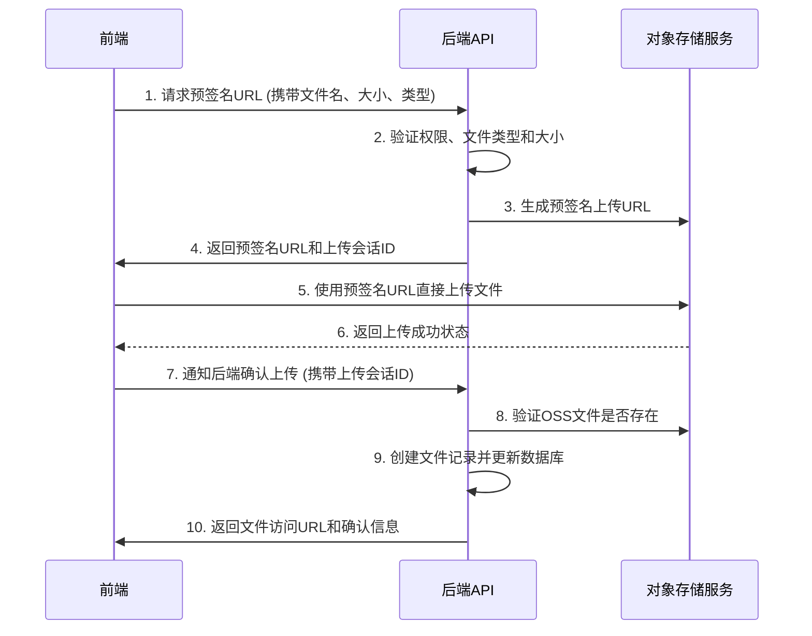

# 直传OSS上传解决方案

## 概述

本方案实现了前端直接上传文件到OSS的功能，避免文件通过服务器中转，有效解决大文件上传超时问题。特别针对视频文件上传进行了全面优化，确保高效、稳定、安全。

## 架构设计

### 上传流程



### 技术优势

- **避免超时**: 文件直接上传到OSS，不经过服务器，彻底解决大文件上传因服务器处理时间过长导致的超时问题。
- **减少服务器负载**: 服务器仅处理元数据和认证，不消耗CPU和带宽处理文件流，极大提升了系统的并发处理能力。
- **提高上传速度**: 客户端直连OSS，利用OSS的全球加速节点和优化的网络路径，上传速度更快。
- **支持超大文件**: 不再受限于服务器的内存、磁盘和`client_max_body_size`配置，理论上支持OSS允许的任意大小文件。
- **断点续传与分片上传**: 方案可轻松扩展以支持分片上传和断点续传，进一步提升大文件上传的稳定性和用户体验。
- **精细化会话管理**: 通过Redis管理上传会话，可实现上传状态跟踪、进度查询、取消上传等高级功能。
- **高并发与批量上传**: 前端实现并发控制，支持批量文件高效上传，后端通过异步处理和队列机制保证系统稳定性。

## 后端实现

### 1. 直传上传服务 (`direct-upload.service.ts`)

**核心功能**:
- **生成预签名URL**: 根据文件类型、大小和用户权限，生成一个有时效性的、安全的上传URL。
- **管理上传会话**: 在Redis中创建并管理每个上传操作的会话，记录状态（`pending`, `uploading`, `completed`, `failed`, `cancelled`）。
- **验证文件合法性**: 严格校验文件类型和大小，防止非法文件上传。
- **确认上传**: 在前端通知上传完成后，验证OSS上文件是否存在，并在数据库中创建文件记录。

**主要方法**:
```typescript
class DirectUploadService {
  // 生成预签名URL
  static async generatePresignedUrl(params: PresignedUrlParams): Promise<PresignedUrlResponse>;
  
  // 确认上传完成
  static async confirmUpload(params: ConfirmUploadParams): Promise<FileRecord>;
  
  // 取消上传
  static async cancelUpload(uploadSessionId: string, userId: string): Promise<void>;
  
  // 查询上传进度（可扩展）
  static async getUploadProgress(uploadSessionId: string, userId: string): Promise<UploadProgress>;
}
```

**文件类型配置**:
```typescript
const FILE_TYPE_CONFIG = {
  video: {
    maxSize: 500 * 1024 * 1024, // 500MB
    allowedTypes: ['video/mp4', 'video/avi', 'video/mov', 'video/wmv', 'video/flv', 'video/webm', 'video/mkv']
  },
  // ... 其他文件类型
};
```

### 2. 统一OSS服务接口 (`oss.service.ts`)

为了支持多种OSS服务商（如MinIO, Aliyun OSS），我们定义了一个统一的接口。

```typescript
export interface OssService {
  getPresignedUploadUrl(key: string, expires?: number, contentType?: string): Promise<string>;
  fileExists(key: string): Promise<boolean>;
  // ... 其他方法
}
```

### 3. 直传上传路由 (`direct-upload.ts`)

**API接口**:
- `POST /api/v1/direct-upload/presigned-url`: 获取预签名URL。
- `POST /api/v1/direct-upload/confirm`: 确认上传完成。
- `POST /api/v1/direct-upload/cancel`: 取消上传。

**请求与响应示例**:
```json
// 请求预签名URL
POST /api/v1/direct-upload/presigned-url
{
  "fileName": "wedding_highlights.mp4",
  "fileSize": 524288000,
  "contentType": "video/mp4",
  "fileType": "video"
}

// 响应
{
  "success": true,
  "data": {
    "uploadSessionId": "session-uuid-12345",
    "presignedUrl": "https://oss.example.com/bucket/path?signature=...",
    "ossKey": "videos/user-id/timestamp_random_filename.mp4"
  }
}
```

## 前端实现

### 1. 直传上传核心工具 (`direct-upload.ts`)

**核心类**:
- `DirectUploader`: 处理单个文件的完整上传流程，包括获取预签名URL、上传到OSS、确认上传。
- `BatchDirectUploader`: 管理多个文件的批量上传，支持并发控制和整体进度跟踪。

**功能特性**:
- ✅ **实时上传进度**: 精确监控上传百分比、速度和剩余时间。
- ✅ **完整状态管理**: `pending` → `uploading` → `completed`/`failed`/`cancelled`。
- ✅ **自动重试**: 网络波动或OSS临时错误时自动重试，提升成功率。
- ✅ **图片压缩**: 上传前可对图片进行客户端压缩，节省带宽和存储。
- ✅ **文件验证**: 前端预验证，减少不必要的API请求。
- ✅ **批量并发控制**: 可配置并发上传数量，避免浏览器请求阻塞。
- ✅ **取消上传**: 支持随时取消单个或批量上传。

### 2. 直传上传服务 (`direct-upload.ts`)

封装了不同业务场景的上传方法，简化组件调用。

```typescript
class DirectUploadService {
  // 上传视频
  async uploadVideo(file: File): Promise<DirectUploadResult>;
  
  // 批量上传作品图片
  async uploadWorkImages(files: File[]): Promise<DirectUploadResult[]>;
  
  // ... 其他专用方法
}
```

## Nginx配置优化

为了配合直传方案，Nginx配置也进行了相应优化。

### 1. 生产环境 (`nginx.prod.conf`)

我们为直传API端点 `/api/v1/direct-upload/` 创建了一个新的`location`块。

```nginx
# 直传服务代理
location /api/v1/direct-upload/ {
    proxy_pass http://api_backend/api/v1/direct-upload/;
    proxy_http_version 1.1;
    proxy_set_header Host $host;
    proxy_set_header X-Real-IP $remote_addr;
    proxy_set_header X-Forwarded-For $proxy_add_x_forwarded_for;
    proxy_set_header X-Forwarded-Proto $scheme;

    # 直传API只处理元数据，请求体小，响应快，无需长超时
    proxy_connect_timeout 10s;
    proxy_send_timeout 60s;
    proxy_read_timeout 60s;

    # 禁用缓存，确保每次都获取最新的预签名URL
    proxy_no_cache 1;
    proxy_cache_bypass 1;
}
```

### 2. 腾讯云环境 (`nginx.tencent.conf`)

腾讯云的配置同样增加了对直传API的支持，并优化了相关参数。

```nginx
# 直传OSS上传API - 视频直传专用优化
location /api/v1/direct-upload/ {
    # 速率限制
    limit_req zone=api_limit burst=20 nodelay;
    limit_conn conn_limit 10;
    
    # 请求体小，超时短
    client_max_body_size 1M;
    proxy_connect_timeout 15s;
    proxy_read_timeout 30s;
    
    # ... 其他代理设置
    
    # 响应头优化
    add_header X-Upload-Method "direct" always;
}
```

**关键变更**:
- **独立的`location`块**: 将直传API与传统文件上传API分离，实现更精细的控制。
- **更短的超时时间**: 由于服务器不处理文件流，直传API的响应非常快，因此设置了更短的超时时间，有助于快速失败和释放连接。
- **禁用缓存**: 预签名URL具有时效性，必须禁用缓存，确保客户端每次都获取有效的URL。
- **合理的速率限制**: 为直传API设置了独立的速率限制，防止恶意请求。

## 总结

通过实施直传OSS方案，我们彻底解决了大文件（特别是视频）上传的瓶颈问题。该方案不仅提升了上传性能和稳定性，还显著降低了服务器的资源消耗，为未来业务的扩展奠定了坚实的基础。